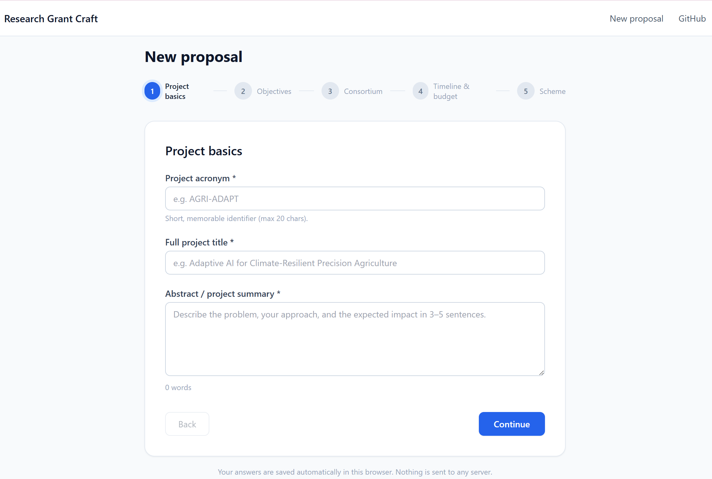
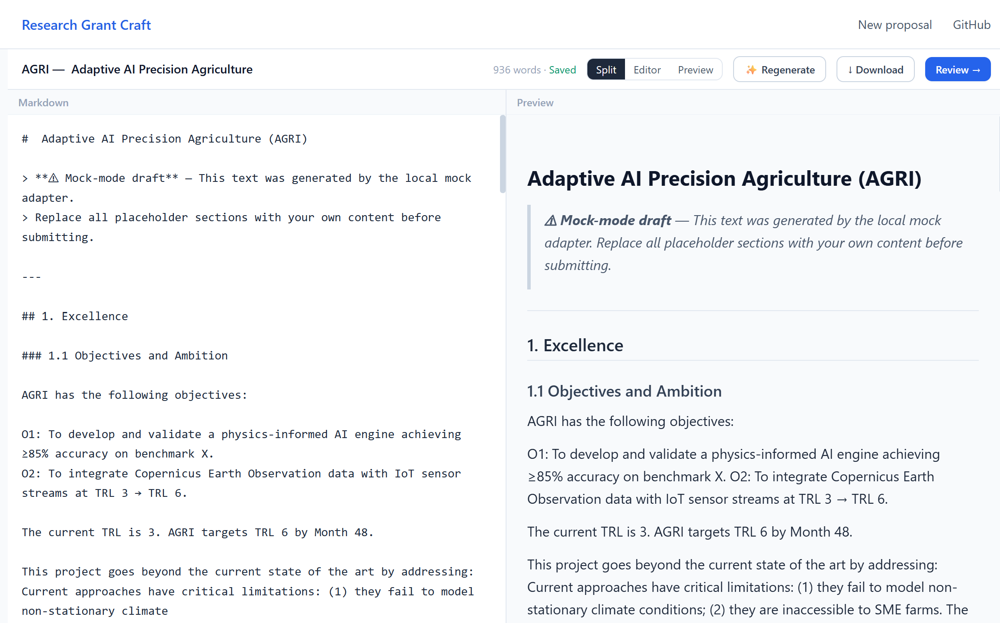
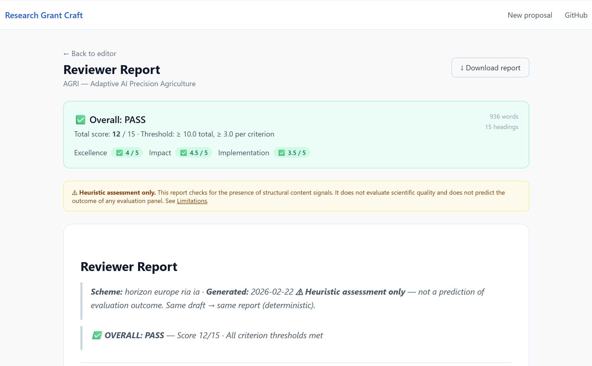

# Research Grant Craft

**Open-source grant proposal wizard + reviewer report for researchers.**

[](LICENSE)
[](https://github.com/selinachegg/research-grant-craft/issues)

---

## What it does

- **Structured proposal wizard** — guides you through objectives, consortium,
  timeline, and budget using scheme-specific scaffolding, so every required
  section is present before you write a word.
- **AI-assisted draft generation** — generates a Markdown draft from your
  wizard answers; works in *mock mode* with no API key, or with any
  OpenAI-compatible endpoint you configure.
- **Deterministic heuristic reviewer report** — analyses your draft against
  22 coverage signals aligned to the funding body's evaluation rubric, and
  produces a scored report with a prioritised action plan. Same draft →
  same report, every time.

## What it does NOT do

- **It does not predict funding outcomes.** The reviewer report checks
  structural completeness, not scientific quality or panel judgement.
- **It does not submit proposals.** There is no integration with the EC
  Funding & Tenders Portal or any other submission system.
- **It does not store your data.** All content lives in your browser's
  local storage. Nothing is sent to servers owned by this project.
  See [PRIVACY.md](PRIVACY.md) and [docs/LIMITATIONS.md](docs/LIMITATIONS.md).

---

## Screenshots

| Wizard intake | Draft editor | Reviewer report |
|:---:|:---:|:---:|
|  |  |  |

---

## Quickstart

**Prerequisites:** Node.js ≥ 18, npm ≥ 9.

```bash
git clone https://github.com/selinachegg/research-grant-craft.git
cd research-grant-craft
npm install
npm run dev
```

Open [http://localhost:3000](http://localhost:3000) in your browser.

```bash
npm test            # run the Jest unit test suite
npm run lint        # ESLint
npm run validate-pack   # validate all scheme pack JSON files
```

---

## Mock mode (no API key required)

By default the app runs in **mock mode**: the LLM generation step returns
static placeholder text and makes no outbound network requests. This means you
can explore the full wizard → draft → reviewer report flow without configuring
any external service.

To use a real language model, set your API endpoint and key in the application
settings panel. See [PRIVACY.md](PRIVACY.md) for what is and is not transmitted.

---

## Privacy

Research Grant Craft is **local-first**:

- Proposal drafts are stored in your browser's `localStorage` only.
- No telemetry, no analytics, no user accounts.
- LLM calls are opt-in; in mock mode no data leaves your browser.

Full details: [PRIVACY.md](PRIVACY.md)

---

## Scheme packs

A **scheme pack** defines the structure, evaluation criteria, and rubric for
one funding programme. The current packs are:

| Pack ID | Programme | Region | Status |
|---------|-----------|--------|--------|
| `horizon_europe_ria_ia` | Horizon Europe RIA / IA | EU | ✅ Stable |

### Adding a new scheme pack

1. Read [`docs/SCHEME_PACK_SPEC.md`](docs/SCHEME_PACK_SPEC.md) for the file
   layout and JSON schemas.
2. Open a [new scheme pack issue](https://github.com/selinachegg/research-grant-craft/issues/new?template=new_scheme_pack.yml)
   to discuss the pack before starting work.
3. Submit a pull request with the new directory under `scheme_packs/`.
4. Run `npm run validate-pack` to confirm the JSON is valid before opening the PR.

---

## Output formats

| Format | Status |
|--------|--------|
| Markdown (draft + reviewer report) | ✅ v0.1 |
| DOCX | Planned — v1.0 |
| LaTeX | Planned — v2.0 |
| PDF | Planned — v2.0 |

---

## Contributing

Contributions are welcome — bug reports, feature requests, new scheme packs,
documentation improvements, and code.

Please read [CONTRIBUTING.md](CONTRIBUTING.md) before opening a pull request.
All contributors are expected to follow the [Code of Conduct](CODE_OF_CONDUCT.md).

---

## How to cite

If you use Research Grant Craft in your research workflow or reference it in a
publication, please cite it using the metadata in
[`CITATION.cff`](CITATION.cff).

A plain-text citation:

> Research Grant Craft Contributors. *Research Grant Craft* (v0.1.0).
> MIT Licence. https://github.com/selinachegg/research-grant-craft

---

## Security

To report a vulnerability, please **do not** open a public issue. Use the
GitHub Security Advisory channel described in [SECURITY.md](SECURITY.md).

---

## License

[MIT](LICENSE) © 2024 Research Grant Craft Contributors
